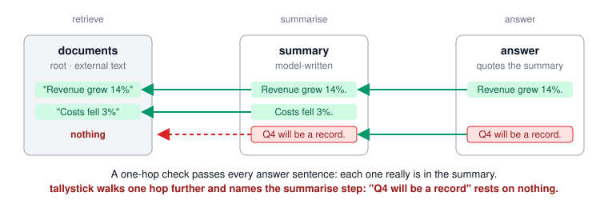

# tallystick

Provenance accounting for LLM agent runs: every claim in the final answer is traced back, hop by hop, to something outside the model — or named, together with the step that invented it.

## TL;DR

- **Problem.** A multi-step agent can invent a fact in an intermediate step and quote it faithfully in the answer; every one-hop check then says "grounded".
- **What it does.** tallystick walks each claim in the answer back to the documents with plain code — no model in the verdict — and names the step where the chain breaks.
- **Result.** On 290 constructed answer sentences it is level with an LLM judge shown the full history: F1 0.59 against 0.58, with a false flag on 7% of clean sentences against 16%.
- **Main finding.** In 443 human-labelled real agent runs ([AgentHallu](https://arxiv.org/abs/2601.06818)), 53% of the hallucinations sit at a step where the agent wrote no prose, only a tool call — beyond this audit's reach (32% if a tool call's own text counts as checkable).
- **Limit.** On 225 real trajectories, where the hallucination is in the agent's own text, it flags the answer in 57% of runs but names the labelled step in 15% — and it flags 35% of clean runs.
- **Details:** [benchmark](docs/benchmark.md) · [design, decisions and lessons](docs/design.md)



**Status:** research prototype, v0.7.x. Interfaces may change between versions. The numbers above are summarised from [docs/benchmark.md](docs/benchmark.md), where each names the run it came from; the per-trace row files are committed under `bench/results/`, and the limits of each measurement are stated next to it.

**Authors:** Katia Engalycheva, with Claude (Anthropic) as co-author. The decisions, reviews and write-ups are mine; much of the typing is not.

Issues and corrections are welcome — especially a case where the audit is wrong.

## The Problem

Teams shipping multi-step agents (retrieve → tool call → summarise → answer) check the answer against its sources with a citation checker, RAGAS faithfulness, or an LLM judge. All of those look at **one hop**: does the answer quote its immediate context?

But the context was usually written by a model too. When a summariser invents a sentence and the answer quotes that summary verbatim, every one-hop check reports 100% grounded. The fabrication acquired the appearance of support by passing through a step that copied it faithfully. Anyone debugging an agent that "cites everything and is still wrong" hits this, and today the answer is a score, not a location.

## The Solution

`tallystick` treats an agent run as a set of books. Each claim is a debit; each piece of evidence is a credit. An entry is verified by three deterministic gates — the cited artifact exists, the step that wrote the claim actually *had* it as an input, and the quoted text is really at that address. Then the chain is walked backwards until it lands on a **root** artifact (a document, a tool result) or breaks.

Where it breaks is the injection point. The output is a step number, not a faithfulness score. No model is asked whether anything is faithful.

## Demo

```
$ tallystick examples/laundered_summary.json

Trial balance — 3 claims in the final answer
──────────────────────────────────────────────────────────
  grounded       2  ████████████░░░░░░  67%
  laundered      1  ██████░░░░░░░░░░░░  33%
──────────────────────────────────────────────────────────
  coverage         66.7%
  laundering rate  33.3%   <- invisible to one-hop checks

1 claim(s) did not close:

  [LAUNDERED] ans_3: Management expects the fourth quarter to be the strongest on record.
      introduced at step s3 (summarize) — model prior, no external evidence
      └─ EVIDENCE:summary#113-181

BOOKS DO NOT BALANCE
```

In that example every sentence of the answer quotes the summary verbatim, so a one-hop checker passes all three. The third sentence was invented at step s3; the filing it came from explicitly says no guidance was given.

Two terms, since they appear above before they are explained. A **posted trace** is a run with its claims and evidence entries already written in — by hand, or by the model-side proposer below. The **trial balance** is the per-claim verdict over the final answer: `grounded` traces to something outside the model, `laundered` cites something real whose own support is missing further back, `unsupported` cites nothing.

```
$ tallystick examples/laundered_summary.json --chain ans_3

ans_3 [laundered] depth=1
  "Management expects the fourth quarter to be the strongest on record."

  1. ans_3 @ step s4
     credit EVIDENCE:summary#113-181  [intermediate]
     quote  "Management expects the fourth quarter to be the strongest on record."

  chain breaks at step s3 on claim sum_4: model prior, no external evidence
  that claim reads: "Management expects the fourth quarter to be the strongest on record."
  and nothing outside the model funds it.
```

## How to Use

```bash
git clone https://github.com/shipwithkatia/tallystick && cd tallystick
pip install -e ".[propose,langchain]"   # plain `pip install -e .` gives the audit path only

# 1. Get a raw trace (artifacts + steps, no claims yet). Either record a
#    LangChain run — or write the JSON by hand, as examples/raw_research_run.json.
python examples/langchain_demo.py          # a 4-step agent, recorded -> raw_langchain.json

# 2. Before spending anything: can this trace be audited at all? No model, no cost.
tallystick check-trace raw_langchain.json
tallystick check-trace raw_langchain.json --json report.json   # for CI
tallystick check-trace raw_langchain.json --min-reachable      # also fail a thin recording

# 3. Let a model post the books: writes a posted trace, then audits it.
#    Needs ANTHROPIC_API_KEY.
tallystick propose raw_langchain.json -o posted.json

# 4. Audit a posted trace. Deterministic, offline, no SDK needed.
tallystick posted.json                 # exit 0 = balance, 1 = don't, 2 = could not run
tallystick posted.json --chain <id>    # full provenance chain for one claim
tallystick posted.json --json out.json # machine-readable balance
tallystick posted.json --quiet         # exit code only
tallystick examples/balanced_run.json  # what a passing gate looks like: exit 0

# Same propose path with canned answers and no network — what CI runs.
tallystick propose examples/raw_research_run.json -o posted.json \
  --proposer fake --script examples/fake_answers.json
```

```python
from tallystick.adapters.langchain import TraceRecorder

rec = TraceRecorder()                                 # one recorder per agent run
chain.invoke(question, config={"callbacks": [rec]})   # any LangChain runnable
rec.save("raw.json")                                  # then: tallystick propose raw.json
```

Exit code 2 covers everything that stops the audit from running — a malformed trace, a missing SDK or key, a proposer that crashed. A bad API key must never read as "books do not balance".

The proposer's output is a file. Two proposer runs may differ; two audits of the same file never do. That boundary is physical: `tallystick/propose/` is the only package allowed to import an SDK, and nothing in the verdict path may import `propose/` by any spelling (`cli.py` may, lazily, inside the `propose` subcommand only). A test walks the AST and fails the build on either.

```python
from tallystick import audit

balance = audit("run.json")
assert balance.books_balance       # drop straight into a test suite

balance.coverage                   # share of final claims that trace to a root
balance.laundering_rate            # share that cite something real but unfunded
balance.injection_points()         # failing claims, each with the step that broke
```

The trace format is plain JSON — artifacts, steps with inputs/outputs, claims by character span, entries — documented in `tallystick/io.py`. `examples/laundered_summary.json` is a complete posted trace; `examples/raw_research_run.json` is the same run before posting; `examples/balanced_run.json` is the same run with an honest summariser, and it balances. A `Run` can also be built in Python from the exported `Artifact`, `Step`, `Claim` and `Entry` types; it gets the same validation as a file.

Before spending anything on a model, `tallystick check-trace` tells you whether a raw trace can be audited at all, and which defects a recorder can fix: [docs/design.md](docs/design.md#before-the-audit-can-this-trace-be-audited-at-all).

## Tradeoffs and Decisions

- **All-of over any-of.** A citation that covers several upstream claims closes only if every one of them does, so a wide, lazy citation inherits the worst sentence it covers. It is stricter and occasionally flags a fine answer.
- **The model proposes into a file; the verdict reads the file.** Two proposer runs may differ; two audits of the same file never do.
- **Verbatim or nothing on the model side.** Letting the proposer paraphrase would raise recall and quietly bring a judgement call back into the credit, so paraphrase is dropped and logged.

The full list, with what each decision cost and what review found: [docs/design.md](docs/design.md#tradeoffs-and-decisions).

## What I Learned

- The interesting failure is not the fabricated sentence — it's the perfectly honest step that copies it.
- Writing and attacking are different jobs. Every serious defect in this repo was found not while writing but in a separate adversarial review whose only brief was to break it — and fixes got the same treatment.
- Decide what the table means before it exists. The caveats and the three rows were published before a single live call, so when the number came in against tallystick on F1 there was nothing to negotiate.

More, with the cases behind each: [docs/design.md](docs/design.md#lessons).

## Next Steps

- [ ] an adapter for log shapes practitioners already have — OpenAI Chat Completions message lists first, then OpenTelemetry GenAI spans
- [ ] v0.8: check *whether* a funding span supports a claim, not only *where* it is
- [ ] PyPI release

Done so far and the full list: [docs/design.md](docs/design.md#next-steps).

## Where This Sits

| | one-hop grounding | across steps | deterministic verdict | names the step | post-hoc on any trace |
|---|---|---|---|---|---|
| Anthropic Citations API | ✅ documents only | ❌ | ✅ | ❌ | ❌ |
| RAGAS / DeepEval / Patronus faithfulness | ✅ | ❌ | ❌ | ❌ | ✅ |
| LLM-as-judge, one-hop context | ✅ | ❌ *(F1 0.05 in the benchmark)* | ❌ | ❌ | ✅ |
| LLM-as-judge, full history | ✅ | ✅ *(F1 0.58 in the benchmark)* | ❌ | ❌ | ✅ |
| [AgentHallu](https://arxiv.org/abs/2601.06818) (Liu et al., 2026) | — | ✅ benchmark: 693 real trajectories, step labelled by hand | ❌ judges; best model finds the step 41% of the time | ✅ | ✅ |
| [Hallucination Snowball](https://arxiv.org/abs/2608.14588) (Singh & Pawar, 2026) | — | ✅ measures escape across 4 agents | — measurement study; detection by GPT-4o and others | ❌ | — |
| [TRACER](https://arxiv.org/html/2605.09934) (Yu, Jia et al., 2026) | ✅ | ✅ dependency graph to tool turns | partly: schema checks; semantics judged by Gemini | ✅ | ❌ agent emits its own provenance |
| [CAMS](https://arxiv.org/html/2606.23989v2) (Guan, 2026) | ✅ claim-anchored spans | ❌ one step | span resolution deterministic; claims extracted by a model, faithfulness scored by NLI models | ❌ | ❌ |
| LEDGER ([arXiv 2608.18398](https://arxiv.org/abs/2608.18398)) | ✅ | ✅ | ❌ *(authors' own caveat)* | partly | ✅ |
| **tallystick** | ✅ | ✅ *(F1 0.59 in the benchmark)* | ✅ audit; proposer is a model | ✅ | ✅ |

The rows other than the two judges and tallystick are my reading of public documentation (the products) and of the papers' abstracts and method sections (the papers) as of September 2026, not benchmark results; the F1 cells come from the [benchmark](docs/benchmark.md).

What the 2026 papers around it measure, and what tallystick does that none of them do together: [docs/design.md](docs/design.md#related-work).

## Built With

- Python 3.10+; the verdict path is standard library only
- `anthropic` SDK, optional, for the proposer
- `langchain-core`, optional, for the recorder
- pytest

## Why a tally stick

An Exchequer tally was a stick notched with an amount and split lengthwise. Payer and payee each kept a half. To settle, the halves were fitted back together and the notches and the grain had to line up. No clerk's opinion was involved, and a forged half simply did not fit.

## License

MIT

---
Built by Katia Engalycheva, co-authored with Claude (Anthropic) | [GitHub](https://github.com/shipwithkatia) | [LinkedIn](https://www.linkedin.com/in/katiaengalycheva/)
